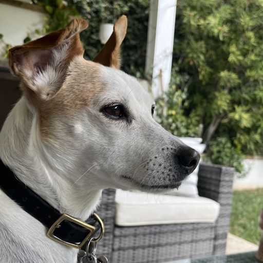
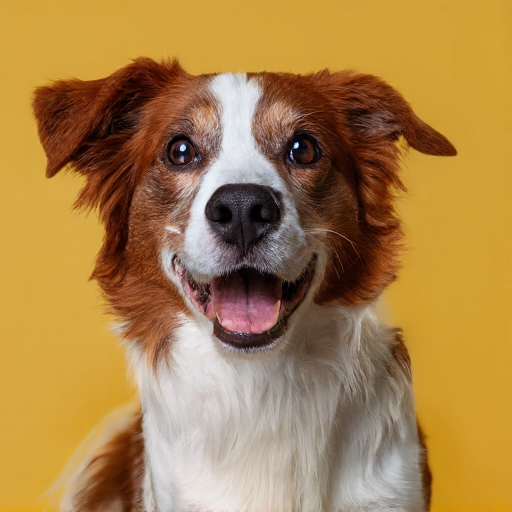
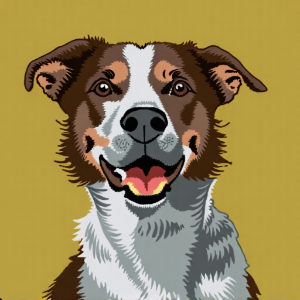
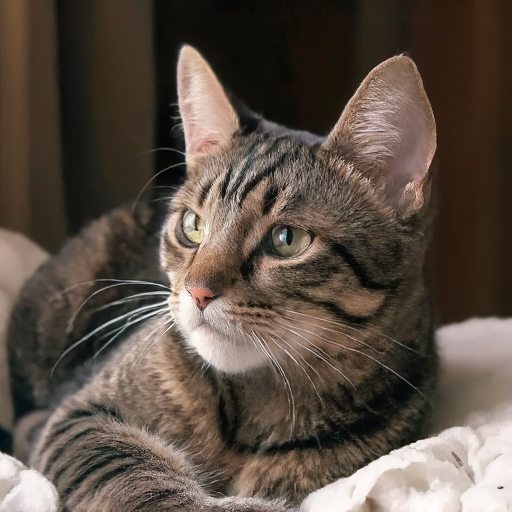
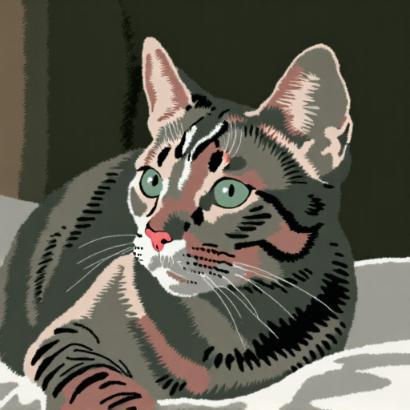

# Pair Customization Flux

The flux implementation of our method.

[**Paper**](https://arxiv.org/abs/2405.01536) | [**Project Page**](https://maxwelljon.es/project_pages/PairCustomization/index.html)

### Training Pair
 

### Generated Images With and Without Style After Training
 
 
 


## Getting Started
**Environment Setup**
- First clone our environment and cd into the corresponding folder (the flux folder for this method). If you've already cloned the repo, no need for the clone step: 
    ```
    git clone https://github.com/maxwelljones14/PairCustomization.git
    cd PairCustomization/PairCustomizationFlux
    ```
 - We provide a [txt file](requirements.txt) that contains all the required dependencies. 
    ```
    pip install -r requirements.txt
    ```
- This can be used for a virtual environment:
  ```
  python3 -m venv venv
  source venv/bin/activate
  pip install -r requirements.txt
  ```

- Alternatively, you can create a conda environment in the following way: 
  ```
  conda create --name PairCustomization
  conda activate PairCustomization
  pip install -r requirements.txt
  ```
Make sure to confirm that torch.cuda.is_available() is true

**Evaluating a model**

We provide an example trained model weight for flux at [this link](https://www.cs.cmu.edu/~model-weight-storage/) (flux-lora-dog-digital-art-style.safetensors). First, change the ```local_path``` parameter in the inference/run_inference.py file to match the location of the LoRA adapters. You can also change the ```cache_dir``` variable in the ```get_models``` function to determine where your models should be cached/retrieved from. 

 To evaluate a model, run
```
python inference/run_inference.py
```
while in the PairCustomizationFlux folder. Generating stylized images may take ~1.5x as long as normal images due to the updated inference path used for generation, which is detailed in section 3.3 of the paper. 

If you experience overfitting to the training image/not enough style application, try updating the ```style_guidance_scale``` term either down or up.

**Training a model**

To train a model, we provide a training script based on the [xflux lora implementation](https://github.com/XLabs-AI/x-flux) for the flux model. 
The training code is currently set up to train using the image pair in the initial example:


curtesy of [Jack Parkhouse](https://www.instagram.com/parkhouse_art/)

To run the training script, first you need to set the ```output_dir``` variable in the training/test_pair_customization_original.yaml file in PairCustomizationFlux. After that, you can simply run: 
```
sh training/train_flux_lora_deepspeed.sh
```
while in the PairCustomizationFlux folder. See the sh file itself as well as test_pair_customization_original.yaml for more details. I use deepspeed with 4 NVIDIA RTX A6000 GPUs on a single node for training.

**Experimental Training**

Since flux has so many layers, and some community members have experimented with only adding LoRA to some layers, we provide an experimental config file called  ```test_pair_customization_disjoint.yaml```. This adds content weights to the even layers of the flux model, and style weights to the odd layers. Since the weights are on disjoint layers, there is no need for orthogonal adaption as described in the last paragraph of section 3.2 in the paper. Currently, the layers are set to "even" and "odd", but you can also pass in a list of layers to use: e.g. 0, 3, 4, 5; for content and style weights in both the double and single flux blocks. Experimentally, I have found this training slightly degrades performance, but feel free to do more testing! :)


