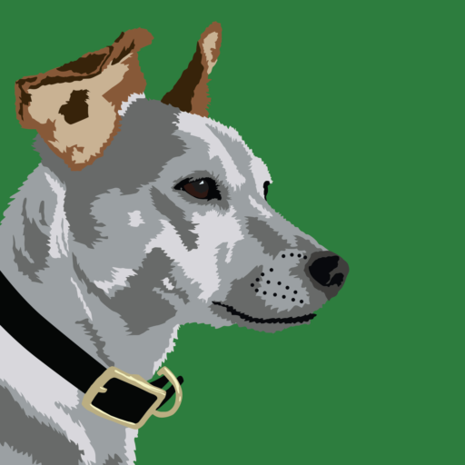

# Pair Customization

[**Paper**](https://paircustomization.github.io/) | [**Project Page**](https://paircustomization.github.io/)


## Getting Started
**Environment Setup**
- First clone our environment and cd into the corresponding folder: 
    ```
    git clone https://github.com/PairCustomization/PairCustomization.git
    cd PairCustomization  
    ```
 - We provide a [txt file](requirements.txt) that contains all the required dependencies. 
    ```
    pip install -r requirements.txt
    ```
- This can be used for a virtual environment:
  ```
  python3 -m venv venv
  source venv/bin/activate
  pip install -r requirements.txt
  ```

- Alternatively, you can create a conda environment in the following way: 
  ```
  conda create --name PairCustomization
  conda activate PairCustomization
  pip install -r requirements.txt
  ```
Make sure to confirm that torch.cuda.is_available() is true

**Evaluating a model**

We provide example trained model weights at [this link](https://drive.google.com/drive/folders/1KeZwisE6s-FqS6wGkdb6exHASfOsPg6A?usp=drive_link).

 To evaluate a model, run
```
python evaluation_scripts/evaluate.py
```
Generating stylized images may take ~1.5x as long due to the updated inference path used for generation, which is detailed in section 3.3 of the paper. If you still experience overfitting to the training image, try lowering the "lora_guidance_scale" term to 3.0

We also allow for multiple LoRAs to be combined via equation (11) in section 3.3. For this funcitonality, run:
```
python evaluation_scripts/evaluate_multiple_adapters.py
```


**Training a model**

To train a model, first initialize an [🤗Accelerate](https://github.com/huggingface/accelerate/) environment via:
```
accelerate config
```
For a default Accelerate environment, you can run:
```
accelerate config default
```
The training code is currently set up to train using the following image pair:

 

curtesy of [Jack Parkhouse](https://www.instagram.com/parkhouse_art/)

To run the training script, you can simply run: 
```
sh training_scripts/train_pair_customization_lora_sdxl.sh
```
See the sh file itself for more details. Currently training is on the dog_digital_art_style images in the data folder. After training, the model should get stored in the example_loras folder. Training/generating validation images should take ~16 minutes on an NVIDIA A5000 24GiB GPU.

